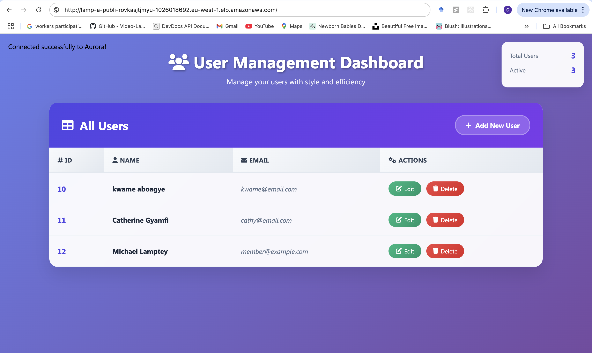
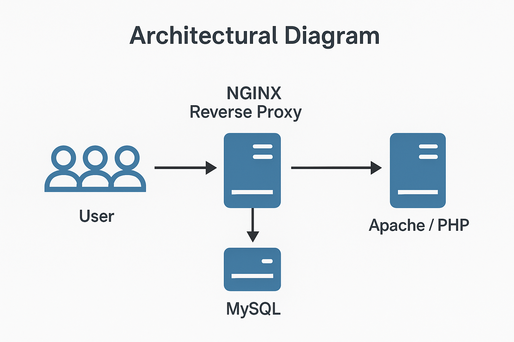
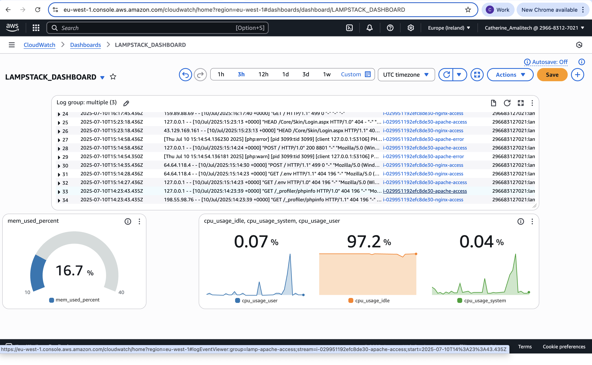

# LAMP Stack Deployment on AWS with Aurora, NGINX Reverse Proxy, and CloudWatch Monitoring

This project demonstrates how to deploy a secure and observable LAMP (Linux, Apache, MySQL-compatible Aurora, PHP) stack application on AWS. It follows best practices from the AWS Well-Architected Framework, including real-time monitoring, centralized logging, and alerting using CloudWatch.

## 🔗 Live Demo

Access the deployed PHP CRUD application:

👉 [http://54.72.80.82/index.php](http://54.72.80.82/index.php)

---

## 📐 Project Architecture

- **Client** → NGINX (Reverse Proxy on port 80)
- **Web Server** → Apache HTTP Server (on port 8080)
- **App Language** → PHP
- **Database** → Amazon Aurora (MySQL-compatible)
- **Monitoring** → CloudWatch Agent
- **Logging** → CloudWatch Logs
- **Alerting** → CloudWatch Alarms + SNS Email Notifications

User Request
↓
[ NGINX (port 80) ]
↓
[ Apache (port 8080) ]
↓
[ Aurora MySQL DB ]

markdown
Copy code

---

## 📁 Application Structure

Deployed in `/var/www/html/`:
- `index.php` – Display all records
- `create.php` – Add a new entry
- `update.php` – Edit a record
- `delete.php` – Delete a record
- `db.php` – Database connection
- `info.php` – Detailed view

---

## 🚀 Deployment Steps

### ✅ 1. Infrastructure Provisioning
- EC2 instance in a public subnet (`Lampstack`)
- Aurora MySQL cluster in a private subnet (`lamp_app`)
- Security groups to allow:
  - HTTP (port 80)
  - SSH (port 22)
  - Aurora DB traffic from EC2

### ✅ 2. Web Stack Configuration
- Installed Apache and PHP
- Moved application files to `/var/www/html`
- Configured Apache to run on port `8080`
- NGINX installed and configured as a **reverse proxy** on port `80`
  - Routes traffic to Apache

### ✅ 3. Database Integration
- Aurora endpoint securely configured in `db.php`
- Tested connection from EC2 to Aurora
- Verified all CRUD operations

---

## 📊 Monitoring & Observability

### ✅ CloudWatch Agent
- Installed and configured to collect:
  - `CPU`, `Memory`, and `Disk` usage
  - Log files from NGINX and Apache

### ✅ CloudWatch Logs
- Real-time log streaming from:
  - `/var/log/nginx/access.log` → `lamp-nginx-access`
    
  - `/var/log/nginx/error.log` → `lamp-nginx-error`
  - `/var/log/httpd/access_log` → `lamp-apache-access`
  - `/var/log/httpd/error_log` → `lamp-apache-error`

### ✅ CloudWatch Alarms
| Alarm Name         | Condition                              | Action              |
|--------------------|----------------------------------------|---------------------|
| HighMemoryUsage    | Memory > 80% for 5 mins                | SNS Email Alert     |
| HighCPUUsage       | CPU > 80% for 5 mins                   | SNS Email Alert     |
| DiskUsageHigh      | Disk > 80% used                        | SNS Email Alert     |
| Apache5xxErrors    | 500 errors detected in Apache logs     | SNS Email Alert     |

---

## ✅ Best Practices Followed

- 🔐 IAM roles attached to EC2 for CloudWatch access
- 🛡️ NGINX as reverse proxy for added security
- 📈 Centralized monitoring and alerting with CloudWatch
- 🔄 Aurora is scalable and highly available
- 📦 Log rotation and streaming via CloudWatch
- 🚀 Designed for future scaling and SSL support

---

## 📄 License

This project is for educational and demonstration purposes. For production use, apply enhanced security, backups, and secret management.

---

## 🙌 Acknowledgments

- AWS CloudWatch
- NGINX & Apache documentation
- Aurora MySQL engine
- Amazon EC2 & VPC networking
